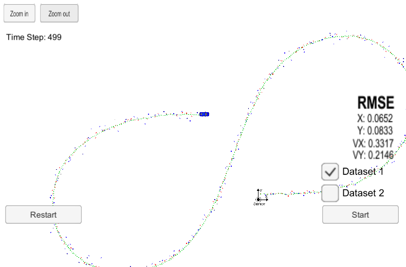
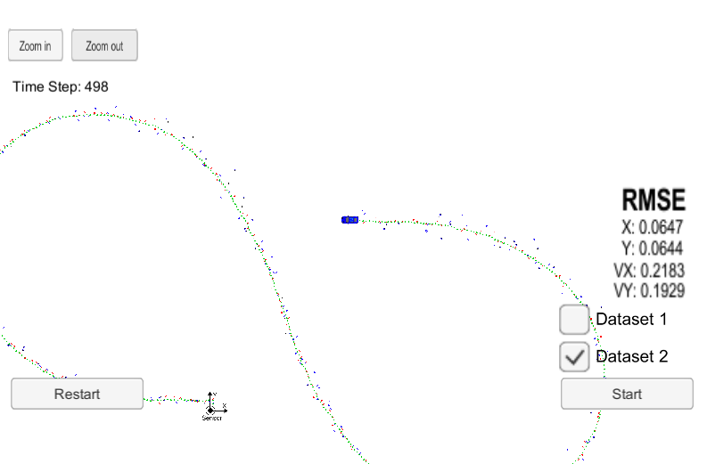

# Unscented Kalman Filter Project

## Background

In this project you will utilize C++ to write an Unscented Kalman filter program to estimate the state of a non linear moving object of interest with noisy Lidar and Radar measurements. Kalman filter is a powerful method to track moving object such us pedestrian or cyclists.

## Build Instruction
- Clone starter files on this [repository](https://github.com/udacity/CarND-Unscented-Kalman-Filter-Project).
- On the repo directory create build directory : "mkdir build".
- Enter "build" directory: "cd build".
- Compile the code : "cmake .. && make".
- Run the code: "./UnscentedKF ". This action open TCP port : 4567.
- Start simulator to connect to listening port.
- Choose "Project 1/1 EKF and UKF". Press "Start" button to run simulator. You should see "Connected!!!" message on terminal.

## Dependecies
* cmake 3.5 or later
* make 4.1 or later
* gcc/g** 5.4 or later

## Generate Additional Data
Generate additional data can be done with help of Matlab scripts mention on this [repository](https://github.com/udacity/CarND-Mercedes-SF-Utilities).

## Calculate RMSE.
RMSE calculation is on src/tool.cpp file.

Final RMSE datasets are :
* Dataset 1 : RMSE <= [0.0652, 0.0833, 0.3317, 0.2146]
* Dataset 2 : RMSE <= [0.0647, 0.0644 0.2183, 0.1929]

Acceptable Unscented Kalman Filter RMSE :
* RMSE <= [0.09, 0.1, 0.40, 0.30]

Simulator screenshot for Dataset1 and 2 as follow :

